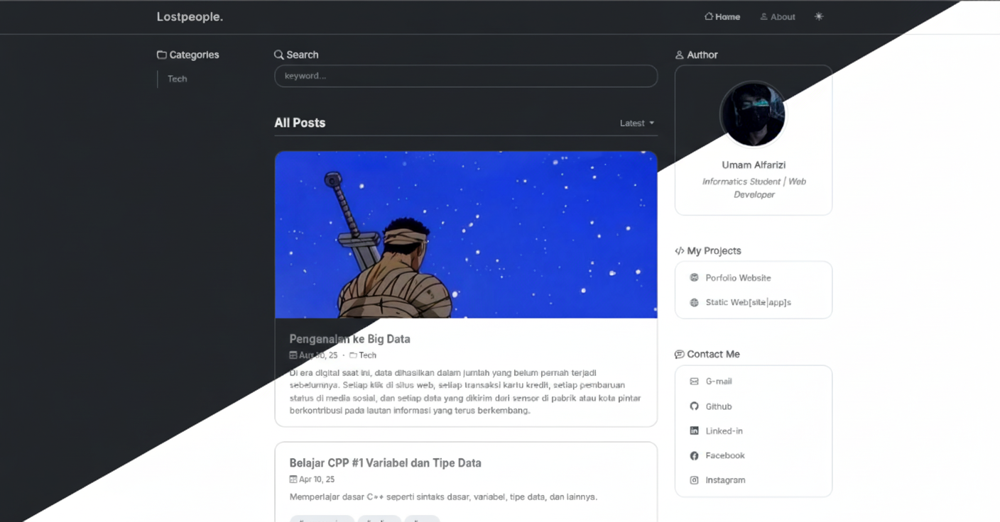

# 🌟 Lostpeople - Personal Blog Platform

<div align="center">
  
</div>

<p align="center">
  <em>A modern, full-stack blog platform built with Express.js and MongoDB</em>
</p>

<div align="center">

[](https://nodejs.org/)
[](https://expressjs.com/)
[](https://mongodb.com/)
[](https://getbootstrap.com/)

</div>

## ✨ Features

- 🎨 **Modern UI/UX** - Clean, responsive design with dark/light theme support
- 📝 **Rich Content Editor** - Markdown support with syntax highlighting
- 🔐 **Secure Authentication** - JWT-based auth with CSRF protection
- 📱 **Mobile Optimized** - Perfect experience across all devices
- 🚀 **Performance Focused** - Optimized loading and smooth interactions
- 🔍 **SEO Ready** - Structured data, meta tags, and search optimization
- 📊 **Reading Progress** - Circular progress indicator on scroll
- 💬 **Comment System** - Integrated with Giscus for discussions
- 🏷️ **Content Management** - Categories, tags, and search functionality
- ☁️ **Cloud Storage** - Cloudinary integration for media files

## 🛠️ Tech Stack

**Backend**
- Node.js & Express.js
- MongoDB with Mongoose
- JWT Authentication
- Session Management

**Frontend**
- EJS Templating
- Bootstrap 5
- Vanilla JavaScript
- Responsive Design

**Tools & Services**
- Cloudinary (File Storage)
- Giscus (Comments)
- Compression & Caching
- SEO Optimization

## 🚀 Quick Start

### Prerequisites
- Node.js (v14 or higher)
- MongoDB
- npm or yarn

### Installation

1. **Clone the repository**
```bash
git clone https://github.com/gper00/lostpeople.git
cd lostpeople
```

2. **Install dependencies**
```bash
npm install
```

3. **Environment Setup**
Create a `.env` file:
```env
PORT=5000
MONGODB_URI=your_mongodb_connection_string
SESSION_SECRET=your_session_secret
CLOUDINARY_CLOUD_NAME=your_cloudinary_cloud_name
CLOUDINARY_API_KEY=your_cloudinary_api_key
CLOUDINARY_API_SECRET=your_cloudinary_api_secret
```

4. **Start the application**
```bash
# Development
npm run dev

# Production
npm start
```

Visit `http://localhost:5000` to see your blog in action! 🎉

## 📁 Project Structure

```
lostpeople/
├── app/
│   ├── config/         # Database & app configuration
│   ├── controllers/    # Route controllers
│   ├── middlewares/    # Custom middlewares
│   ├── models/         # MongoDB models
│   ├── routes/         # API routes
│   └── utils/          # Utility functions
├── public/             # Static assets
│   ├── css/           # Stylesheets
│   ├── js/            # Client-side scripts
│   └── dist/          # Minified assets
├── views/              # EJS templates
└── index.js           # Application entry point
```

## 🎯 Key Features Showcase

### 🌙 Theme System
- Automatic dark/light mode detection
- Smooth theme transitions
- System preference integration
- Persistent user choice

### 📖 Reading Experience
- Circular reading progress indicator
- Mobile-optimized layouts
- Syntax-highlighted code blocks
- Copy-to-clipboard functionality

### 🔧 Performance
- Asset compression and minification
- Lazy loading and caching
- SEO-optimized meta tags
- Progressive Web App ready

## 🤝 Contributing

1. Fork the repository
2. Create your feature branch (`git checkout -b feature/AmazingFeature`)
3. Commit your changes (`git commit -m 'Add some AmazingFeature'`)
4. Push to the branch (`git push origin feature/AmazingFeature`)
5. Open a Pull Request

## 📄 License

This project is open source and available under the [MIT License](LICENSE).

---

<div align="center">
  <p>Made with ❤️ by <strong>Umam Alfarizi</strong></p>
  <p>
    <a href="https://github.com/gper00">GitHub</a> •
    <a href="https://linkedin.com/in/umam-alfarizi">LinkedIn</a> •
    <a href="mailto:alfariziuchiha@gmail.com">Email</a>
  </p>
</div>
