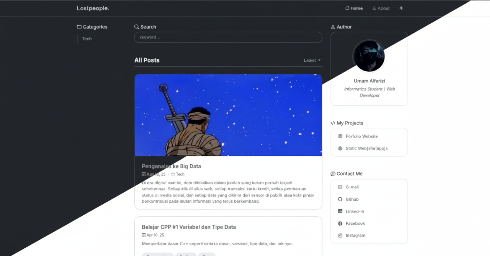

# Lostpeople - Personal Blog Platform

<div align="center">
  
</div>

<p align="center">
  <em>A modern, full-stack blog platform built with Express.js and MongoDB</em>
</p>

<div align="center">

[](https://nodejs.org/)
[](https://expressjs.com/)
[](https://mongodb.com/)
[](https://getbootstrap.com/)

</div>

## Features

Lostpeople offers a comprehensive blogging experience with modern UI/UX design that adapts seamlessly to both dark and light themes. The platform provides a rich content editor supporting Markdown with syntax highlighting, making it easy to create and format blog posts with professional appearance.

Security is implemented through JWT-based authentication with CSRF protection, ensuring user data remains safe. The responsive design delivers an optimal experience across all devices, from desktop computers to mobile phones.

Performance optimization includes efficient loading mechanisms and smooth user interactions. The platform is SEO-ready with structured data, proper meta tags, and search engine optimization features built-in.

Additional functionality includes a circular reading progress indicator that tracks scroll position, an integrated comment system powered by Giscus for reader discussions, comprehensive content management with categories and tags, plus search functionality. Media files are handled through Cloudinary integration for reliable cloud storage.

## Tech Stack

The backend is built with Node.js and Express.js framework, utilizing MongoDB with Mongoose for data management. Authentication is handled through JWT tokens with secure session management to ensure user data protection.

The frontend uses EJS templating engine combined with Bootstrap 5 for responsive design components. Client-side functionality is implemented using vanilla JavaScript to maintain lightweight performance without additional framework dependencies.

External services include Cloudinary for reliable file storage and media management, Giscus for community-driven comment systems, and various optimization tools for compression, caching, and SEO enhancement to improve overall user experience and search engine visibility.

## Quick Start

### Prerequisites
- Node.js (v14 or higher)
- MongoDB
- npm or yarn

### Installation

1. Clone the repository
```bash
git clone https://github.com/gper00/lostpeople.git
cd lostpeople
```

2. Install dependencies
```bash
npm install
```

3. Environment Setup
Create a `.env` file:
```env
PORT=5000
MONGODB_URI=your_mongodb_connection_string
SESSION_SECRET=your_session_secret
CLOUDINARY_CLOUD_NAME=your_cloudinary_cloud_name
CLOUDINARY_API_KEY=your_cloudinary_api_key
CLOUDINARY_API_SECRET=your_cloudinary_api_secret
```

4. Start the application
```bash
# Development
npm run dev

# Production
npm start
```

Visit `http://localhost:5000` to see your blog in action!

## Project Structure

```
lostpeople/
├── app/
│   ├── config/         # Database & app configuration
│   ├── controllers/    # Route controllers
│   ├── middlewares/    # Custom middlewares
│   ├── models/         # MongoDB models
│   ├── routes/         # API routes
│   └── utils/          # Utility functions
├── public/             # Static assets
│   ├── css/           # Stylesheets
│   ├── js/            # Client-side scripts
│   └── dist/          # Minified assets
├── views/              # EJS templates
└── index.js           # Application entry point
```

## Key Features Showcase

### Theme System
The application features automatic dark and light mode detection that integrates seamlessly with system preferences. Theme transitions are smooth and visually appealing, while user choices are persisted across sessions for a consistent experience.

### Reading Experience
The platform provides a circular reading progress indicator that tracks scroll position, giving readers a visual sense of their progress through articles. Mobile-optimized layouts ensure comfortable reading on any device, while syntax-highlighted code blocks enhance technical content presentation. Copy-to-clipboard functionality is available for code snippets.

### Performance
Asset compression and minification reduce load times significantly. The application implements lazy loading and intelligent caching strategies to optimize performance. SEO-optimized meta tags and structured data improve search engine visibility, and the platform is designed to be Progressive Web App ready for enhanced mobile experiences.

## Contributing

1. Fork the repository
2. Create your feature branch (`git checkout -b feature/AmazingFeature`)
3. Commit your changes (`git commit -m 'Add some AmazingFeature'`)
4. Push to the branch (`git push origin feature/AmazingFeature`)
5. Open a Pull Request

## License

This project is open source and available under the [MIT License](LICENSE).

---

<div align="center">
  <p>Made with ❤️ by <strong>Umam Alfarizi</strong></p>
  <p>
    <a href="https://github.com/gper00">GitHub</a> •
    <a href="https://linkedin.com/in/umam-alfarizi">LinkedIn</a> •
    <a href="mailto:alfariziuchiha@gmail.com">Email</a>
  </p>
</div>
